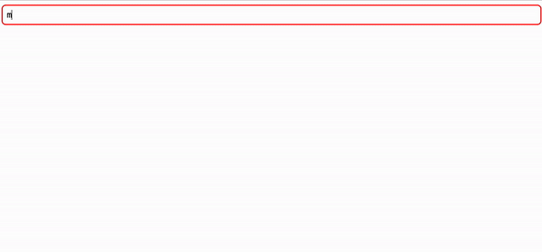

# DasmaQL Svelte - Work in Progress

The DasmaQL component is a Svelte component built on top of the [npm package dasmaql](https://www.npmjs.com/package/dasmaql). It provides support for highlighting, autocompletion, and model generation, which can be utilized in both frontend and backend applications.

## Features

- **Highlighting**: Svelte DasmaQL component supports syntax highlighting for enhanced readability and understanding of DasmaQL queries.
- **Autocompletion**: It offers autocompletion functionality to assist users in typing DasmaQL queries more efficiently and accurately.
- **Model Generation**: The component can generate DasmaQL query models based on provided fields and search callbacks, facilitating easier integration with backend systems.

## Example Usage

Parameters

- **fields**: An array of valid fields for autocompletion suggestions.
- **callbackSearch**: A callback function to search for parameters based on the provided field and search query.

```svelte
<script lang="ts">

    const callbackSearch = (field: string, search: string): (string | { label: string })[] => {
        // Placeholder for search functionality
        // Replace with actual search logic
    
        // Return dummy search result for example
        return [label: '"some result"'];
    };
</script>

<SvelteDasmaQl {fields} {callbackSearch} />
```

## Demo


